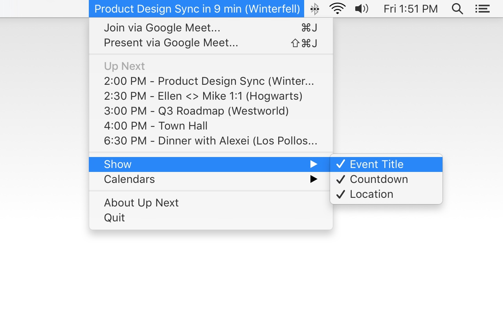

## Up Next

See your day at a glance. Integrated with [Google Meet](https://meet.google.com/) so you can quickly join meetings with `⌘J` or present to meetings with `⇧⌘J`. **Up Next** is a menu bar app for macOS 10.12+.

Install the latest version from the [App Store](https://itunes.apple.com/us/app/up-next/id1355117041?ls=1&mt=12). :v:

## Credits

**Up Next** is written in Swift and Ruby. Branding, design, frontend and web development by [Ellen Li](https://github.com/ellenli). Backend development by [Mike Ragalie](https://github.com/ragalie).

Up Next also uses these resources:
- [HotKey](https://github.com/soffes/HotKey) for managing global keyboard shortcuts
- [DateTools](https://github.com/MatthewYork/DateTools) to simplify date/time data handling
- [macOS-UI-Kit](https://github.com/alexkaessner/macOS-UI-Kit) for rapid product design

Have questions? Found bugs? [Drop them here](https://github.com/ellenli/up-next/issues) or [get in touch on Twitter](https://twitter.com/ellenxli). :wave:
